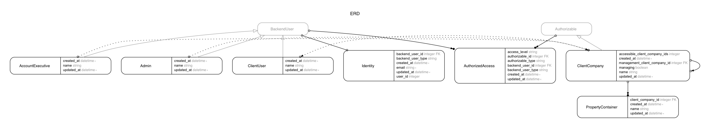

# Backend user authorizable demo

In this repo, I will learn access control system for a Rails app through the `AuthorizedAccess` model. I learned this technique from [Danieth](https://github.com/Danieth).

## Features

- `BackendUser` is a polymorphic model that represents all the non-general users.
- `Authorizable`is a polymorphic model that represents all the things that we want access control for.
- We have the join table `AuthorizedAccess` that store one-to-one mapping of
a `BackendUser` record and a `Authorizable` record.

## Models

